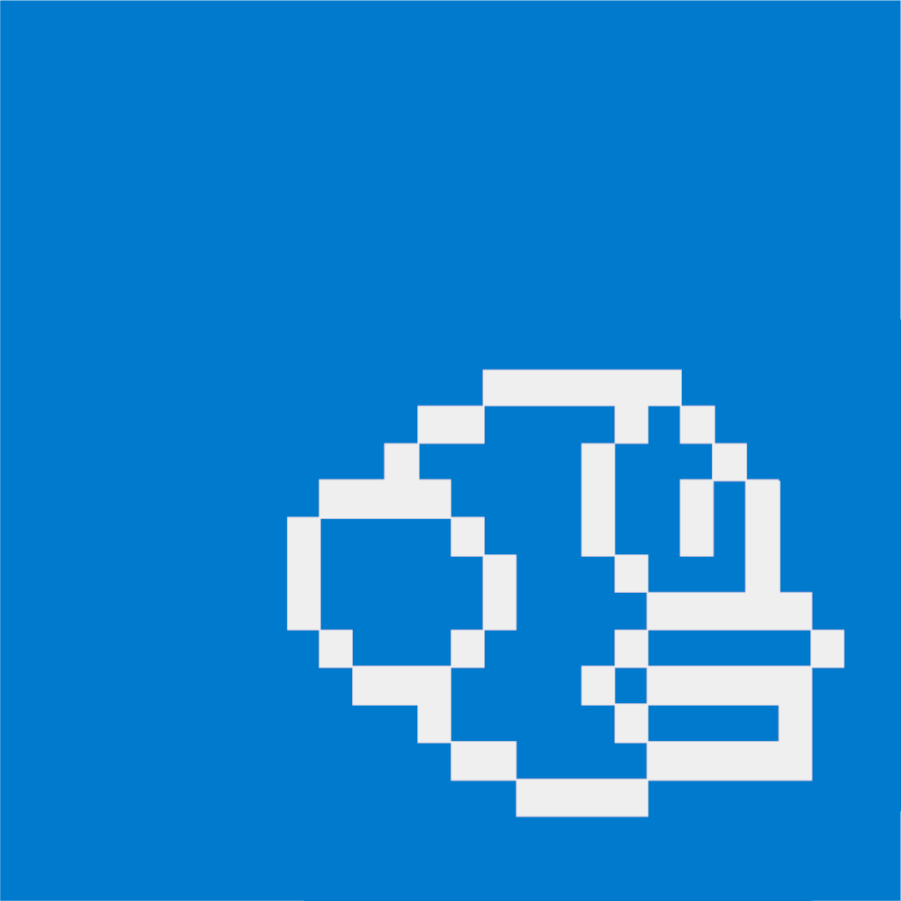

  

# Flappy Bird Clone

## Perchè?

Vincenzo?! Il terzo clone di FlappyBird??

Che dire amici e amiche, ogni 6 mesi faccio un clone di FlappyBird e non mi piace nemmeno come gioco. Li faccio per allenarmi a cambiare linguaggio. E poi questo è i gran lunga la versione più ambiziosa: React, Vite, TypeScript, Redux. Un gigantesco overkill per un applicazione così semplice, ma il punto non era giocare a FlappyBird ma giocare a configurare l'esportazione dei tipi del redux Store

## Funzionalità

- **Grafica in stile pixel art**: Grafica pixel art animata con css e keyframs.
- **Sistema di punteggio**: Guadagna punti passando attraverso gli ostacoli e salva il tuo record in un database 
- **Responsiveness**: Ottimizzato per dispositivi mobili e tablet.

<a href="https://flappy-react-ts.vercel.app/">Provalo!</a>